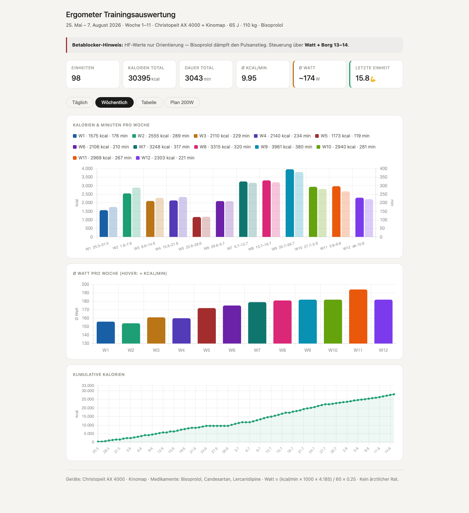

# Ergometer Training Log

Personal indoor-cycling training log (Christopeit AX 4000 + Kinomap), tracked since 25 May 2026.

## Dashboard

`training.html` is the main dashboard — open it in a browser. It has four tabs:

- **Täglich** — Ø Watt, Kalorien, Trainingszeit und Max-Puls pro Tag
- **Wöchentlich** — Kalorien & Minuten sowie Ø Watt pro Woche, kumulative Kalorien
- **Tabelle** — alle Trainingseinheiten einzeln, mit Blutdruck-Werten wo vorhanden
- **Plan 200W** — Watt-Progression, erreicht vs. Ziel

`training_dashboard_export.pdf` is a print export of all four tabs.

## Data files

- `training_data.csv` — one row per session (Datum, Dauer, kcal, Watt, Max HF, Woche)
- `kinomap_rennwerte.csv` — Kinomap-Fahrten mit Strecke, Distanz, Höhenmeter, Temperatur, Kadenz
- `training_data_mysql.sql` — älterer Export mit Blutdruck-Werten (nicht mehr aktuell gehalten)

All data lives as hardcoded JS arrays inside the HTML files — there's no database or build step. See `CLAUDE.md` for how the files relate to each other and the watt-estimation formula.

## Other files

- `stufentest.html` / `stufentest_regression.html` — Stufentest-Kalibrierung (Watt ↔ Puls)
- `wkg_histogram.html`, `training_slideshow.html` — weitere Einzel-Dashboards
- `PulsCharts/` — Puls-Screenshots der Watch mit Übersichtsseite
