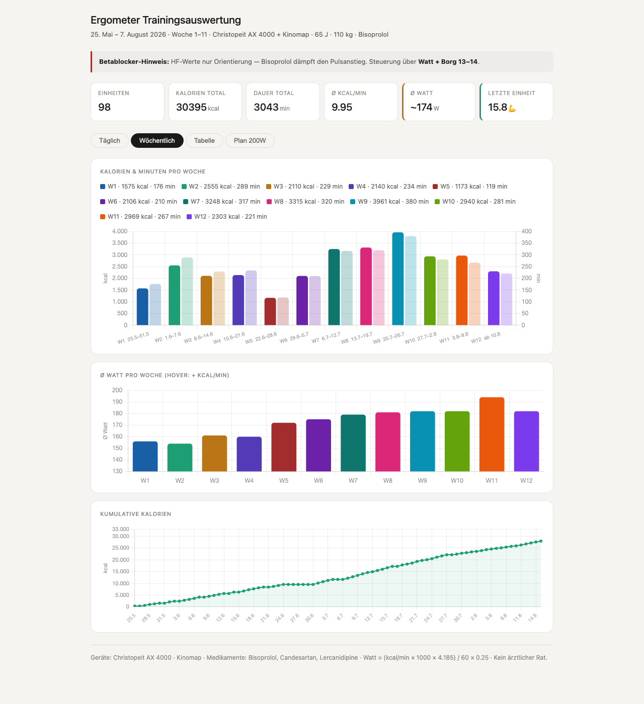
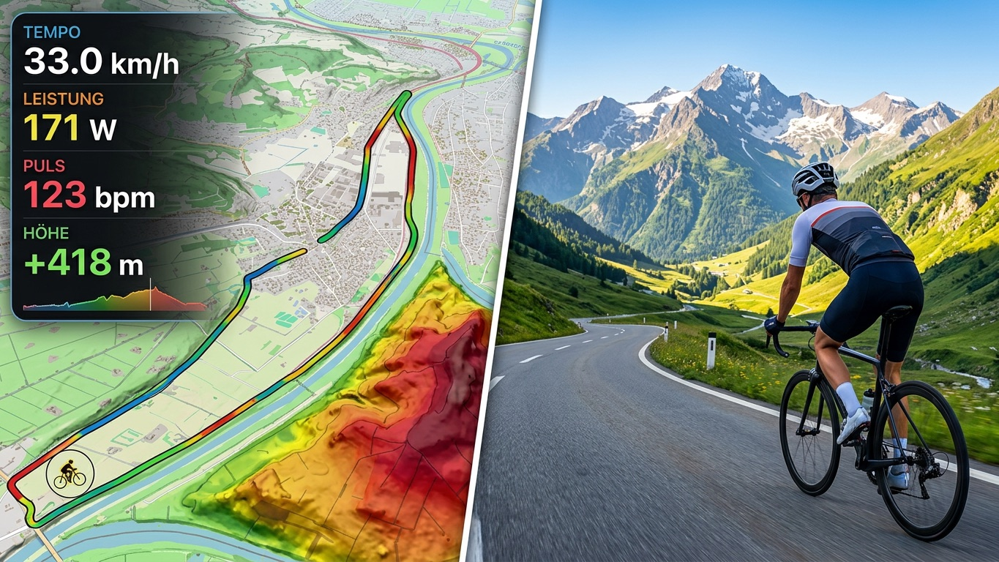

# Ergometer Training Log

Personal indoor-cycling training log (Christopeit AX 4000 + Kinomap), tracked since 25 May 2026. The pages themselves are in German; this README describes them in English.

## Dashboard

`training.html` is the main dashboard — it fetches `training_log.csv` at load time, so it needs to be served over HTTP rather than opened directly (e.g. `python3 -m http.server` from this folder, then open `http://localhost:8000/training.html`). It has four tabs:

- **Daily** — average watt, calories, training time and max heart rate per day
- **Weekly** — calories and minutes as well as average watt per week, cumulative calories
- **Table** — every training session individually, with blood-pressure readings where available
- **200 W plan** — watt progression, achieved vs. target

`training.pdf` is a print export of all four tabs.

## 3D ride replay

A ride exported from Kinomap (`export_<id>.zip`) can be turned into two map pages with the `kinomap-karte` skill. Each page links to the other, and like the dashboard both must be served over HTTP. Currently in the repo: the ride Widnau – Widnau of 6 October.

### 3D map — `karte_<D.M>_<route>_3d.html`

The ride replayed in a 3D scene of the real landscape:

- **Terrain and buildings** — an elevation model of the area with the OpenStreetMap map as ground texture, plus the buildings along the route as 3D blocks; around the rider the map is reloaded in sharper detail
- **Route** — a line coloured by power, blue (low) to red (high)
- **Cyclist** — a figure on a road bike that pedals and follows the route
- **Playback** — play/pause, time-lapse at 10×, 30× or 90×, and a slider for the position
- **Camera** — free to rotate and zoom, or a follow mode: a chase camera locked onto the rider that you can drag around them in a circle and zoom in and out, or let circle automatically
- **Rider's view** — a small picture top right showing the road through the rider's eyes
- **Profile** — top left: speed, power, pulse and elevation over the distance; click or drag to jump there
- **Cockpit** — a bike computer with four dials (speed, power, pulse, cadence) plus distance, time and elevation
- **Sound** — pedal and chain noise in the rhythm of the real cadence, quiet breathing that speeds up with power (from the ride's lowest to its highest watt reading), and a heartbeat at the measured pulse; a checkbox mutes it

### 2D map — `karte_<D.M>_<route>.html`

The same ride as a flat, zoomable OpenStreetMap page:

- **Key figures** — distance, duration, power, heart rate, cadence and speed (average and max each), plus elevation range and total climb
- **Map** — the route coloured by a selectable metric (power, heart rate, cadence, speed or elevation) with a colour scale; start/finish is marked
- **Profile** — the selected metric over the distance, with the elevation profile as an area behind it
- **Linking** — moving the mouse over the profile shows that spot on the map and all values of that moment

## Data files

- `training_log.csv` — the single source of truth: one row per session (or per rest-day blood-pressure log), with date, duration, kcal, watt, max heart rate and blood pressure, plus structured Kinomap fields (route, distance, elevation gain, temperature, cadence). Everything else (weekday, week number, cumulative kcal, charts, table) is derived from this file by `training.html` at render time.

There's no database or build step. See `CLAUDE.md` for the CSV schema, the watt-estimation formula, and how to add a new session (via the `add-training` skill).

## Other files

- `index.html` — landing page linking to everything below
- `blutdruck.html` — blood-pressure report (target band and histograms), generated by the `bldr` skill
- `stufentest.html` / `stufentest_regression.html` — step-test calibration (watt vs. pulse)
- `wkg_histogram.html`, `training_slideshow.html` — further single-purpose dashboards
- `PulsCharts/` — heart-rate screenshots from the watch with an overview page
